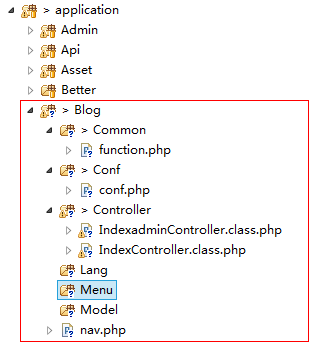
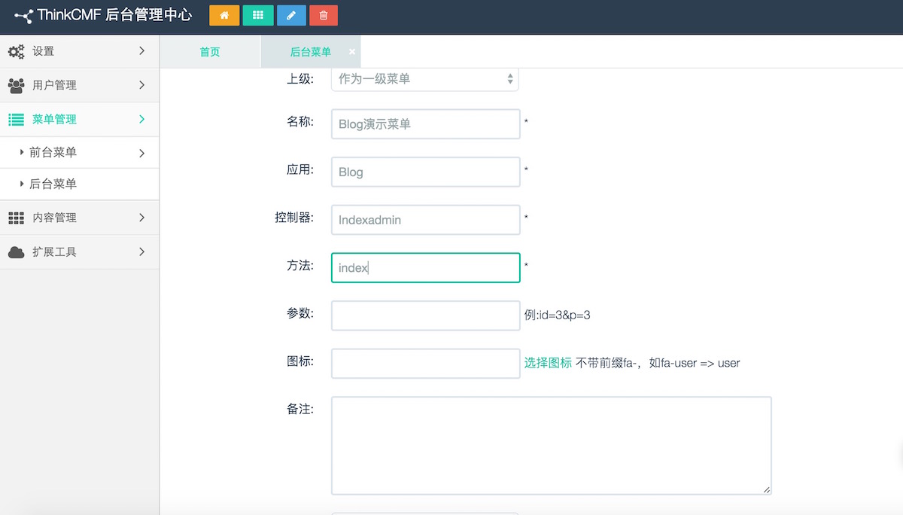

# ThinkCMF应用开发流程

以下教程适用于ThinkCMFX系列版本
以Blog模块为例(相关问题已经更新)
1. 在application目录下创建Blog目录
Blog结构:
```php
Blog    
  Controller 控制器目录
  Common 函数库
  Conf 配置
  Lang 多语言包
  Menu 后台菜单    
  Model 模型
  nav.php 前台导航
``` 

Blog结构  
同时在application/Common/Conf/config.php里的MODULE_ALLOW_LIST加上你新加的Blog 

2. 创建一个前台控件器（Controller）
在模块Controller目录下创建一个IndexController.class.php文件
```php
<?php
namespace Blog\Controller;
use Common\Controller\HomebaseController;
class IndexController extends HomebaseController{
function index(){
      echo "this is blog index !";
}
}
```
前台Controller一般都要继承HomebaseController
3. 为前台 IndexController的index方法创建一个模板
  1. 修改IndexController.class.php  
    ```php
    <?php
    namespace Blog\Controller;
    use Common\Controller\HomebaseController;

    class IndexController extends HomebaseController{
        function index(){
          $this->display(":index");
        }
    }
    ```
  * 在程序前台当前模板目录下创建Blog目录(假设当前模板是simplebootx，当前模板目录./themes/simplebootx)
在Blog目录下创建index.html文件

4. 在浏览器里运行http://你的域名/index.php?g=blog&m=index&a=index  
到此为止，一个应用基本创建完成

5. 创建一个后台控件器（Controller）在模块Controller目录下创建一IndexadminController.class.php文件(注意：这里有文件命名规则，以\*\*\*\*adminController.class.php命名的是后台Controller, 在后台菜单导入时会自动识别）
    ```php
    <?php
    namespace Blog\Controller;
    use Common\Controller\AdminbaseController;

    class IndexadminController extends AdminbaseController{

        function index(){
          $this->display();
        }
    }
    ```
后台Controller一般都要继承AdminbaseController
登陆后台，在后台菜单管理添加一个后台菜单

项目，模块，方法一一定要保证和程序代码里的大小写一致性
6. 创建index方法模板  
在程序当前后台模板目录下创建`Blog`目录(当前后台模板为`simplebootx`，当前后台模板目录`admin/themes/simplebootx`)
创建Indexadmin/index.html（后台模板目录分隔符是自己可以在应用配置里自己定义的，`'TMPL_FILE_DEPR'=> '/'`，新建应用默认为/）
7. 刷新后台，点击在5步骤里添加的后台菜单
8. Blog应用开发流程完毕