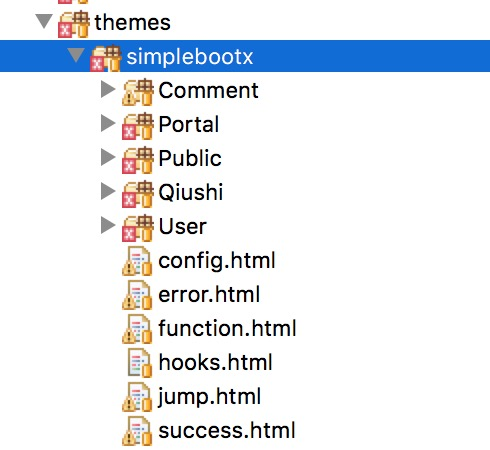
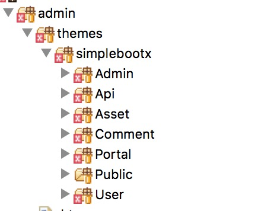

# 模板定义

在 cmf中模板就是一个 html 文件，可分为前台模板文件和后台模板文件；

前台模板位于 themes 目录下，后台模板位于 admin/themes 目录下，前后台都是多主题机制的,可以分开设置不同的主题；

前台默认模板是 simplebootx,以后也可能会换，我们先以这个为例；

这是前台模板的结构；应用之间彼此分开，Portal目录下就对应的是application/Portal应用的模板文件；

一个模板文件大致路径是这样的:themes/主题名/应用名/控制器名/操作名+(.html) 或者 themes/主题名/应用名/自定义模板名+(.html)，如：themes/simplebootx/User/Profile/password.html,themes/simplebootx/Portal/index.html;

后台默认模板也是simplebootx只是和前台的名字一样而已，实质它是后台主题；

和前台的模式基本一样，一个后台模板文件大致路径是这样的: admin/themes/主题名/应用名/控制器名/操作名+(.html) 或者 admin/themes/主题名/应用名/自定义模板名+(.html)，如：admin/themes/simplebootx/Admin/Link/add.html;

『themes/主题名/应用名』和『admin/themes/主题名/应用名』这一部分基本是固定的，开发者最好不要去修改，也最好不要跨应用调用模板，这会让结构很乱，不方便维护；

应用名以后的部分，开发者可以用控制器的display方法指定模板的具体文件名，display用法我们在模板渲染部分会详细说明；